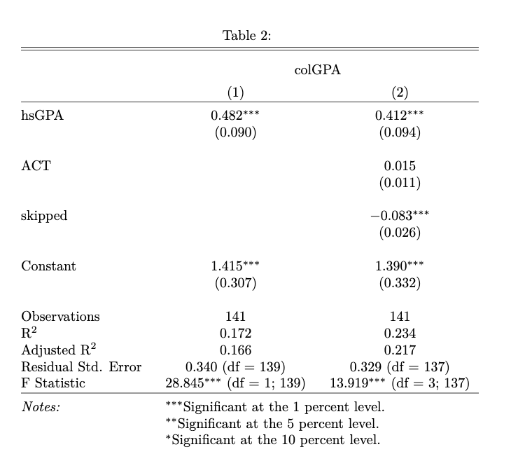

# R-Applied Econometrics Workflow

应用微观的经济学家的工作流会选择使用Stata（宏观学者可能会用Matlab,dynare,Julia）加上LaTeX/Lyx（包括做slides），若可能需要的话加上一些数据库的知识。

这里使用wooldridge包中大学GPA数据来作为演示。

## Stargazer


```r
library(wooldridge)
library(stargazer)
data("gpa1")
```

### 描述性统计

选出我们所关心的几个变量进行描述性统计。


```r
gpa_var <- gpa1%>%
  select(colGPA,hsGPA,ACT,skipped)
```

这里调用`psych`来进行描述性统计，但描述性统计的包并不仅限于此，甚至使用`dplyr`中的`summarize`也是一个比较好的选择。


```r
library(psych)
```


```r
stargazer(describe(gpa_var,trim = F,skew = F,ranges = F),type = "html")
```


<table style="text-align:center"><tr><td colspan="6" style="border-bottom: 1px solid black"></td></tr><tr><td style="text-align:left">Statistic</td><td>N</td><td>Mean</td><td>St. Dev.</td><td>Min</td><td>Max</td></tr>
<tr><td colspan="6" style="border-bottom: 1px solid black"></td></tr><tr><td style="text-align:left">vars</td><td>4</td><td>2.500</td><td>1.291</td><td>1</td><td>4</td></tr>
<tr><td style="text-align:left">n</td><td>4</td><td>141.000</td><td>0.000</td><td>141</td><td>141</td></tr>
<tr><td style="text-align:left">mean</td><td>4</td><td>7.923</td><td>10.871</td><td>1.076</td><td>24.156</td></tr>
<tr><td style="text-align:left">sd</td><td>4</td><td>1.156</td><td>1.179</td><td>0.320</td><td>2.844</td></tr>
<tr><td style="text-align:left">se</td><td>4</td><td>0.097</td><td>0.099</td><td>0.027</td><td>0.240</td></tr>
<tr><td colspan="6" style="border-bottom: 1px solid black"></td></tr></table>
需要记得的是在option中添加`results='asis'`才会将输出代码以raw code的形式放在文本中。这里因为是html格式的缘故，因此将输出格式输出为html。若使用LaTeX输出格式，则最终在tex中所呈现的状态会是


```r
stargazer(describe(gpa_var,trim = F,skew = F,ranges = F),type = "text")
```

```
## 
## =========================================
## Statistic N  Mean   St. Dev.  Min   Max  
## -----------------------------------------
## vars      4  2.500   1.291     1     4   
## n         4 141.000  0.000    141   141  
## mean      4  7.923   10.871  1.076 24.156
## sd        4  1.156   1.179   0.320 2.844 
## se        4  0.097   0.099   0.027 0.240 
## -----------------------------------------
```


### 回归结果报告

先试图去回归一个基准组：


```r
reg.base <- colGPA~hsGPA
lm.base <- lm(reg.base,gpa_var)
```
一个较为常用的快速查看回归结果的方法是使用`summary()`函数。


```r
summary(lm.base)
```

```
## 
## Call:
## lm(formula = reg.base, data = gpa_var)
## 
## Residuals:
##      Min       1Q   Median       3Q      Max 
## -0.85220 -0.26274 -0.04868  0.28902  0.88551 
## 
## Coefficients:
##             Estimate Std. Error t value Pr(>|t|)    
## (Intercept)  1.41543    0.30694   4.611 8.98e-06 ***
## hsGPA        0.48243    0.08983   5.371 3.21e-07 ***
## ---
## Signif. codes:  0 '***' 0.001 '**' 0.01 '*' 0.05 '.' 0.1 ' ' 1
## 
## Residual standard error: 0.34 on 139 degrees of freedom
## Multiple R-squared:  0.1719,	Adjusted R-squared:  0.1659 
## F-statistic: 28.85 on 1 and 139 DF,  p-value: 3.211e-07
```

再添加一组控制组：


```r
gpa.control <- colGPA~hsGPA+ACT+skipped
lm.control <- lm(gpa.control,data = gpa_var)
```


```r
lm.list <- list(lm.base,lm.control)
```


```r
stargazer(lm.list,type = "html")
```


<table style="text-align:center"><tr><td colspan="3" style="border-bottom: 1px solid black"></td></tr><tr><td style="text-align:left"></td><td colspan="2"><em>Dependent variable:</em></td></tr>
<tr><td></td><td colspan="2" style="border-bottom: 1px solid black"></td></tr>
<tr><td style="text-align:left"></td><td colspan="2">colGPA</td></tr>
<tr><td style="text-align:left"></td><td>(1)</td><td>(2)</td></tr>
<tr><td colspan="3" style="border-bottom: 1px solid black"></td></tr><tr><td style="text-align:left">hsGPA</td><td>0.482<sup>***</sup></td><td>0.412<sup>***</sup></td></tr>
<tr><td style="text-align:left"></td><td>(0.090)</td><td>(0.094)</td></tr>
<tr><td style="text-align:left"></td><td></td><td></td></tr>
<tr><td style="text-align:left">ACT</td><td></td><td>0.015</td></tr>
<tr><td style="text-align:left"></td><td></td><td>(0.011)</td></tr>
<tr><td style="text-align:left"></td><td></td><td></td></tr>
<tr><td style="text-align:left">skipped</td><td></td><td>-0.083<sup>***</sup></td></tr>
<tr><td style="text-align:left"></td><td></td><td>(0.026)</td></tr>
<tr><td style="text-align:left"></td><td></td><td></td></tr>
<tr><td style="text-align:left">Constant</td><td>1.415<sup>***</sup></td><td>1.390<sup>***</sup></td></tr>
<tr><td style="text-align:left"></td><td>(0.307)</td><td>(0.332)</td></tr>
<tr><td style="text-align:left"></td><td></td><td></td></tr>
<tr><td colspan="3" style="border-bottom: 1px solid black"></td></tr><tr><td style="text-align:left">Observations</td><td>141</td><td>141</td></tr>
<tr><td style="text-align:left">R<sup>2</sup></td><td>0.172</td><td>0.234</td></tr>
<tr><td style="text-align:left">Adjusted R<sup>2</sup></td><td>0.166</td><td>0.217</td></tr>
<tr><td style="text-align:left">Residual Std. Error</td><td>0.340 (df = 139)</td><td>0.329 (df = 137)</td></tr>
<tr><td style="text-align:left">F Statistic</td><td>28.845<sup>***</sup> (df = 1; 139)</td><td>13.919<sup>***</sup> (df = 3; 137)</td></tr>
<tr><td colspan="3" style="border-bottom: 1px solid black"></td></tr><tr><td style="text-align:left"><em>Note:</em></td><td colspan="2" style="text-align:right"><sup>*</sup>p<0.1; <sup>**</sup>p<0.05; <sup>***</sup>p<0.01</td></tr>
</table>

当然，在回归结果报告还是在描述性统计中，最终的显示格式可以根据不同期刊来进行调整，比如来一个AER：


```r
stargazer(lm.list,type = "html",style = "aer")
```


<table style="text-align:center"><tr><td colspan="3" style="border-bottom: 1px solid black"></td></tr><tr><td style="text-align:left"></td><td colspan="2">colGPA</td></tr>
<tr><td style="text-align:left"></td><td>(1)</td><td>(2)</td></tr>
<tr><td colspan="3" style="border-bottom: 1px solid black"></td></tr><tr><td style="text-align:left">hsGPA</td><td>0.482<sup>***</sup></td><td>0.412<sup>***</sup></td></tr>
<tr><td style="text-align:left"></td><td>(0.090)</td><td>(0.094)</td></tr>
<tr><td style="text-align:left"></td><td></td><td></td></tr>
<tr><td style="text-align:left">ACT</td><td></td><td>0.015</td></tr>
<tr><td style="text-align:left"></td><td></td><td>(0.011)</td></tr>
<tr><td style="text-align:left"></td><td></td><td></td></tr>
<tr><td style="text-align:left">skipped</td><td></td><td>-0.083<sup>***</sup></td></tr>
<tr><td style="text-align:left"></td><td></td><td>(0.026)</td></tr>
<tr><td style="text-align:left"></td><td></td><td></td></tr>
<tr><td style="text-align:left">Constant</td><td>1.415<sup>***</sup></td><td>1.390<sup>***</sup></td></tr>
<tr><td style="text-align:left"></td><td>(0.307)</td><td>(0.332)</td></tr>
<tr><td style="text-align:left"></td><td></td><td></td></tr>
<tr><td style="text-align:left">Observations</td><td>141</td><td>141</td></tr>
<tr><td style="text-align:left">R<sup>2</sup></td><td>0.172</td><td>0.234</td></tr>
<tr><td style="text-align:left">Adjusted R<sup>2</sup></td><td>0.166</td><td>0.217</td></tr>
<tr><td style="text-align:left">Residual Std. Error</td><td>0.340 (df = 139)</td><td>0.329 (df = 137)</td></tr>
<tr><td style="text-align:left">F Statistic</td><td>28.845<sup>***</sup> (df = 1; 139)</td><td>13.919<sup>***</sup> (df = 3; 137)</td></tr>
<tr><td colspan="3" style="border-bottom: 1px solid black"></td></tr><tr><td style="text-align:left"><em>Notes:</em></td><td colspan="2" style="text-align:left"><sup>***</sup>Significant at the 1 percent level.</td></tr>
<tr><td style="text-align:left"></td><td colspan="2" style="text-align:left"><sup>**</sup>Significant at the 5 percent level.</td></tr>
<tr><td style="text-align:left"></td><td colspan="2" style="text-align:left"><sup>*</sup>Significant at the 10 percent level.</td></tr>
</table>

若是在latex中显示就会是这样的：




## 在RStudio中写作

当然要有一整套的workflow不仅仅是将原代码c-p到overleaf，还需要在Rstudio中一整套的工作流程。

在RStudio中进行输出，我们会考虑使用bookdown这个包来进行编辑之间的论文，bookdownplus中有较多关于国内高校的毕业论文bookdown模版，能够直接输入相关命令获取模版。

同时，从最初的Pandoc，再到quarto，typst在近些年得到兴起，其对于格式的多样性支持能够帮助我们获取。但这些新兴文本输入工具可能使用并非广泛，比较常用的方法仍然是选择LaTeX+R，基本上可以实现大部分的功能


```r
stargazer(describe(gpa_var,trim = F,skew = F,ranges = F),
          type = "latex",
          out = "olsreg.tex")
```

```
## 
## % Table created by stargazer v.5.2.3 by Marek Hlavac, Social Policy Institute. E-mail: marek.hlavac at gmail.com
## % Date and time: Tue, Jun 13, 2023 - 17:06:55
## \begin{table}[!htbp] \centering 
##   \caption{} 
##   \label{} 
## \begin{tabular}{@{\extracolsep{5pt}}lccccc} 
## \\[-1.8ex]\hline 
## \hline \\[-1.8ex] 
## Statistic & \multicolumn{1}{c}{N} & \multicolumn{1}{c}{Mean} & \multicolumn{1}{c}{St. Dev.} & \multicolumn{1}{c}{Min} & \multicolumn{1}{c}{Max} \\ 
## \hline \\[-1.8ex] 
## vars & 4 & 2.500 & 1.291 & 1 & 4 \\ 
## n & 4 & 141.000 & 0.000 & 141 & 141 \\ 
## mean & 4 & 7.923 & 10.871 & 1.076 & 24.156 \\ 
## sd & 4 & 1.156 & 1.179 & 0.320 & 2.844 \\ 
## se & 4 & 0.097 & 0.099 & 0.027 & 0.240 \\ 
## \hline \\[-1.8ex] 
## \end{tabular} 
## \end{table}
```

在LaTeX中使用下述语法即可直接在同一文件夹中导入回归表格。

```
\include{olsreg.tex}
```

其好处在于随时可以对回归结果进行更新。


## Presentation

同样的道理，一个好的论文不仅仅是在写作，也还需要进行sale，学界通常情况下会选择使用beamer来进行制作slides。

同样R中也是支持Beamer，对应的介绍在[统计之都](https://cosx.org/2022/08/beamer-not-down/)中有极为详细的介绍。但在这里更加推崇的是使用xaringan，一个以javascripts为基础的网页slides制作包。相关的介绍可以在[Yihui个人网站](https://slides.yihui.org/xaringan/zh-CN.html#5)。


