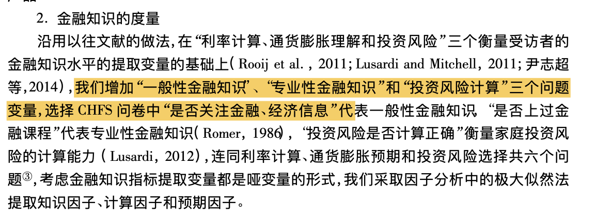

# CHFS

[CHFS](https://chfs.swufe.edu.cn/)是西南财经大学组织的中国家庭金融调查。中国家
庭金融调查采用三阶段、分层、与人口规模成比例(PPS)的抽样方法，通过科学抽样、现
代调查技术和调查管理手段，收集中国家庭金融微观信息，为国内外研究者提供研究
中国家庭金融问题的高质量微观数据。
CHFS样本覆盖全国29个省，262个县，总共包含28000多户家庭的资产负债、收入与支出、保险与保障，家庭人口特征及就业等方面详细信息的大型微观数据。


## 数据读取
从其官网下载2019年的调查数据


```r
library(haven)
chfs_hh2019 <- read_dta("data/chfs/CHFS_2019/chfs2019_hh_202112.dta")
```


```r
library(purrr)
get_var_label <- function(dta) {
  labels <- map(dta, function(x) attr(x, "label"))
  tibble(
    name = names(labels),
    label = as.character(labels)
  )
}
```


## 构建变量

### 社会互动

- Du et al. (2014)

- 社会互动相关的礼金支出、外出就餐支出、娱乐支出、通讯支出、交通支出、旅游
探亲支出、兄弟姐妹数量、与父母通话次数 8 个变量。


### 金融知识

在CHFS中第五部分就是关于金融知识、底层治理与主观评价。




```r
chfs_hh2013 <- read_dta("data/chfs/CHFS_2013/chfs2013_hh_20191120_version14.dta")
chfs_hh2013%>%get_var_label()
```

```
## # A tibble: 2,184 × 2
##    name      label                 
##    <chr>     <chr>                 
##  1 hhid_2011 household id in 2011  
##  2 hhid_2013 household id in 2013  
##  3 a2000a    居住在一起家庭成员个数
##  4 a2000b    外出家庭成员个数      
##  5 a1001     地址是否正确          
##  6 a1002     是否居民住宅          
##  7 a1003     住宅户数              
##  8 a1007     主要经济活动          
##  9 a1008     是否常住本市          
## 10 a1009     有无外国国籍          
## # … with 2,174 more rows
```


```r
dim(chfs_hh2013)
```

```
## [1] 28141  2184
```

```r
chfs_hh2013%>%
  select(starts_with("a400"))->df2_a
df2_na <- na.omit(df2_a) 
dim(df2_na)
```

```
## [1] 26922     7
```

```r
df2_na%>%
  get_var_label()
```

```
## # A tibble: 7 × 2
##   name    label                             
##   <chr>   <chr>                             
## 1 a4002a  对经济、金融信息的关注度          
## 2 a4002b  上学期间是否上过经济、金融课程    
## 3 a4003   投资风险态度                      
## 4 a4004a  100元存5年的本息和                
## 5 a4005a  100元存款一年后的购买力           
## 6 a4006a  100%得4000和50%得10000的偏好      
## 7 a4007aa 单买一只股票和买一只股票基金的风险
```


参考 @ZhangGoDong2016 的做法：


```r
df2_na%>%
  mutate(fa1=case_when(
    a4002a%in%c(1,2,3)~1,
    a4002a%in%c(4,5)~0
  ))%>%
  mutate(fa2 = case_when(
    a4002b==1~1,
    a4002b==2~0
  ))%>%
   mutate(fa3 = case_when(
    a4007aa==1~1,
    a4007aa!=1~0
  ))%>%
  mutate(fa4=case_when(
    a4004a==2~1,
    a4004a!=2~0
  ))%>%
  mutate(fa5=case_when(
    a4006a==2~1,
    a4006a==1~0
  ))%>%
   mutate(fa6=case_when(
    a4005a==1~1,
    a4005a!=1~0
  ))%>%
  select(starts_with("fa"))->df_fa
```


```r
library(visdat)
df_fa %>%
  vis_dat()
```

<!-- -->


```r
mean_fa <- map_dbl(df_fa,mean)
mean_fa
```

```
##        fa1        fa2        fa3        fa4        fa5        fa6 
## 0.37118342 0.08160612 0.30740658 0.15474333 0.26799643 0.16072357
```

得到的均值水平会比原文章都普遍较高一些。但因素5的偏差较大。（但本人又认为这个变量不太好，更像是一个风险测试的问题，与受访者的风险偏好有关，并没有一个所谓正确的答案）


```r
1-mean_fa[5]
```

```
##       fa5 
## 0.7320036
```


#### 因子转换


```r
library(psych) #KMO和Bartlette检验所需包
```

```
## 
## Attaching package: 'psych'
```

```
## The following objects are masked from 'package:ggplot2':
## 
##     %+%, alpha
```

```r
KMO(df_fa)
```

```
## Kaiser-Meyer-Olkin factor adequacy
## Call: KMO(r = df_fa)
## Overall MSA =  0.65
## MSA for each item = 
##  fa1  fa2  fa3  fa4  fa5  fa6 
## 0.64 0.64 0.66 0.69 0.70 0.70
```
都大于0.6，勉强适合。


```r
bartlett.test(df_fa)
```

```
## 
## 	Bartlett test of homogeneity of variances
## 
## data:  df_fa
## Bartlett's K-squared = 10938, df = 5, p-value < 2.2e-16
```
p值非常小，也验证可以做因子。


```r
corr=cor(df_fa)
eig=eigen(corr)
(ccx=(eig$va)/sum(eig$va))  #贡献率
```

```
## [1] 0.2677825 0.1643641 0.1626099 0.1501068 0.1306874 0.1244494
```

```r
(cx=cumsum(eig$va)/sum(eig$va)) #累计方差贡献率
```

```
## [1] 0.2677825 0.4321466 0.5947564 0.7448632 0.8755506 1.0000000
```


```r
fit <- factanal(df_fa, 3, rotation="promax") # 第2个参数是提取的因子个数
print(fit, digits=2, sort=TRUE) # 输出结果
```

```
## 
## Call:
## factanal(x = df_fa, factors = 3, rotation = "promax")
## 
## Uniquenesses:
##  fa1  fa2  fa3  fa4  fa5  fa6 
## 0.74 0.75 0.80 0.00 0.95 0.92 
## 
## Loadings:
##     Factor1 Factor2 Factor3
## fa4  1.00                  
## fa1          0.38    0.18  
## fa2          0.49          
## fa3          0.34    0.15  
## fa5                  0.22  
## fa6                  0.30  
## 
##                Factor1 Factor2 Factor3
## SS loadings       0.99    0.51    0.20
## Proportion Var    0.17    0.08    0.03
## Cumulative Var    0.17    0.25    0.28
## 
## Factor Correlations:
##         Factor1 Factor2 Factor3
## Factor1    1.00    0.17    0.23
## Factor2    0.17    1.00    0.58
## Factor3    0.23    0.58    1.00
## 
## The degrees of freedom for the model is 0 and the fit was 0
```


### 金融排斥

“是否有金融账户”来作为是否是存在金融排斥的代理变量。


```r
chfs_hh2013 %>%
  select(d1101)%>%
  dplyr::filter(!is.na(d1101))%>%
  mutate(cur= case_when(
    d1101 == 1~1,
    d1101 == 2~0
  ))->df3
mean(df3$cur)
```

```
## [1] 0.595189
```


也就是有人民币活期存款账户的有59.51%。但根据文章中的定义：还需要对其余的金融账户进行筛选，通过逻辑运算实现。


